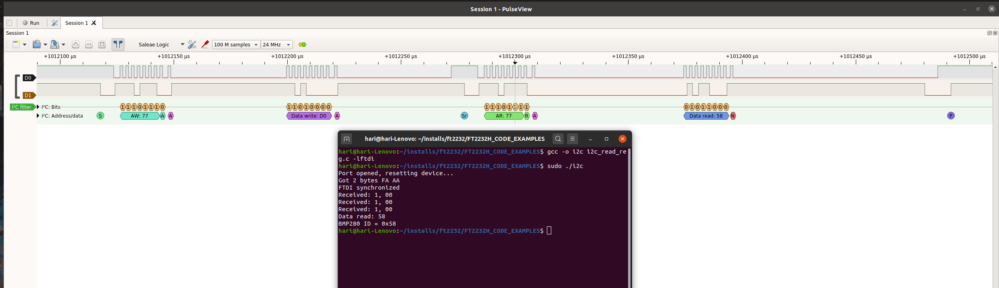

# FT2232H_CODE_EXAMPLES

Ubuntu 20.04 terminal applications using FT2232HL to communicate with spi and i2c peripherals.

Install libftdi with `sudo apt-get install libftdi-dev`.

Uses interface A (AD<n> bus) for SPI / I2C interface. Interface B is free to be used as serial UART.

## SPI interface

Example code `spiflash_read_id.c` reads the JEDEC ID information from an W25Q16 SPI serial flash by sending the 
command 0x9F and then reading 3 consecutive bytes. SPI clock configured for 1MHz.

## I2C interface

Example code `i2c_read_reg.c` reads the device ID register at address 0xD0 from a BMP280 pressure sensor
configured in I2C mode with slave address 0XEE (8bit address). I2C clock configured for 400kHz.

