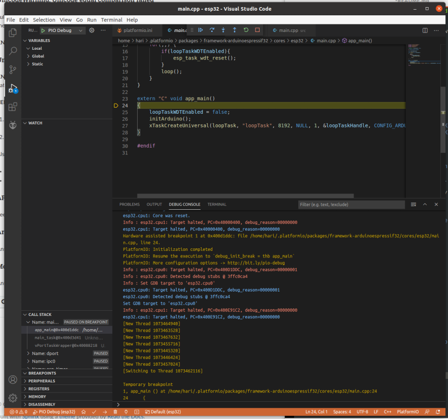

# FT2232HL USB module used as esp-prog JTAG adapter 

* The official Espressif esp-prog JTAG programmer uses a FT2232Hx chip, we
can use any FT2232HL adapter instead 
* Channel A used as JTAG interface
* Channel B used as serial port
* ESP32 must have pins GPIO12..GPIO15 free for JTAG interface
* TXD/RXD pins optional for serial communication
* Visual Studio Code with Platformio extension on Ubuntu 20.04


## ESP32 to FT2232HL USB module connections

```
ESP32      FT2232HL USB module
                   
GND        GND  
Vin        VCC(5V)

           JTAG (channel A)
GPIO13     AD0 (TCK) 
GPIO12     AD1 (TDI) 
GPIO15     AD2 (TDO) 
GPIO14     AD3 (TMS) 

           Serial (channel B)
TXD        BD1 (RXD)
RXD        BD0 (TXD)		        
```	


## Add udev rules on Ubuntu 20.04		    

Download and install [99-platformio-udev.rules](https://docs.platformio.org/en/latest/plus/debug-tools/esp-prog.html)
```
sudo cp 99-platformio-udev.rules /etc/udev/rules.d/99-platformio-udev.rules
sudo service udev restart
```

Now you should only see one ttyUSB port (channel B serial port) when you plug in the FT2232HL adapter.

## Platformio.ini modification

Add `debug_tool` and `upload_protocol` entries

platformio.ini example

```
[env:esp32_dev_module]
platform = espressif32
board = esp32dev
framework = arduino
monitor_speed = 115200
monitor_port = /dev/ttyUSB*
debug_tool = esp-prog
upload_protocol = esp-prog
```

## Upload 

* Click on the Platformio icon (bug-eyed alien)
* In the Platformio sidebar go to Project Tasks -> Upload
* Alternatively, using cli in terminal window
```
cd <project dir>
pio home
pio run --target upload
```

## Debug

* Click on the Platformio icon
* In the Platformio sidebar go to Quick Access -> Debug -> Start Debugging




