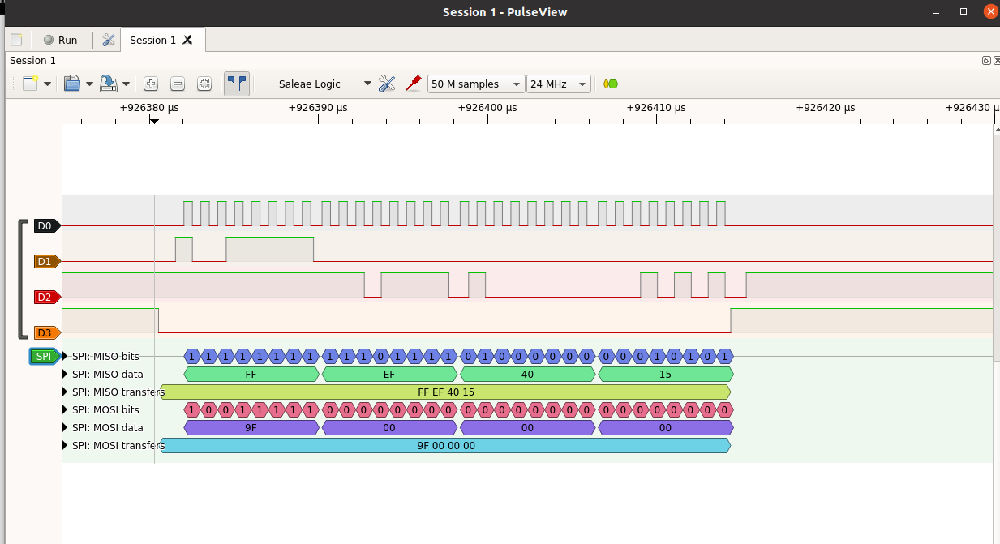
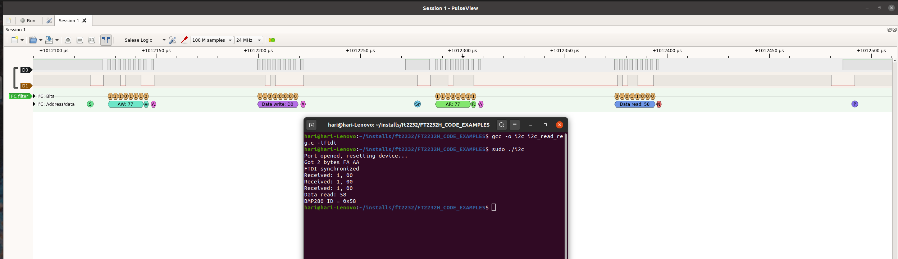

# FT2232H Ubuntu Code Examples


Ubuntu 20.04 terminal applications using FT2232HL USB adapter to communicate with SPI and I2C slave devices.

Uses module interface A (AD bus) for SPI / I2C interface. Interface B is free to be used as a serial UART.

## Platform

* Ubuntu 20.04 amdx64
* Install libftdi with `sudo apt-get install libftdi-dev`

## FT2232H interface pinout


## SPI Master interface

Example code `spiflash_read_id.c` reads the JEDEC ID `0xEF4015` from an W25Q16 SPI serial flash by sending the 
command 0x9F and then reading 3 consecutive bytes. SPI clock configured for 1MHz.

```
AD0 : CLK
AD1 : MOSI
AD2 : MISO
AD3 : CSn
```




## I2C Master interface


Example code `i2c_read_reg.c` reads the device ID data `0x58` at  register address 0xD0 from a BMP280 pressure sensor
configured in I2C mode with 7-bit slave address 0x77. I2C clock configured for 400kHz.



Note : for I2C interface pins AD1 and AD2 need to be connected together for SDA bi-directional function.

```
AD0		: SCLK
AD1+AD2	: SDA
```

Reference : FTDI Application note AN_411


