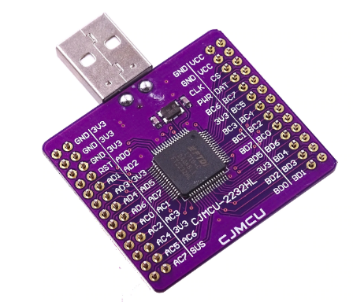
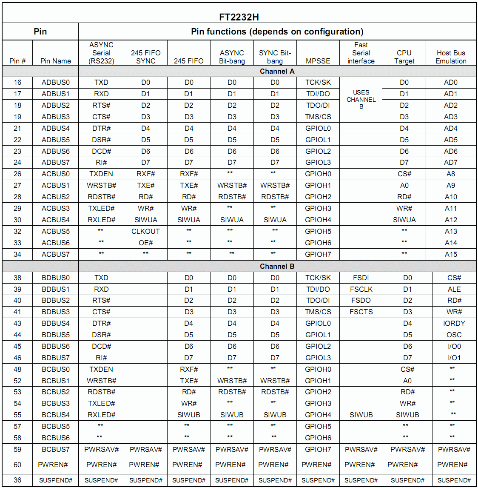
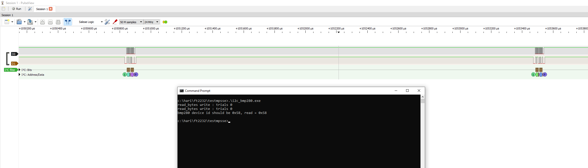
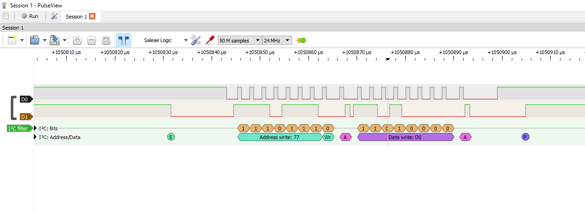
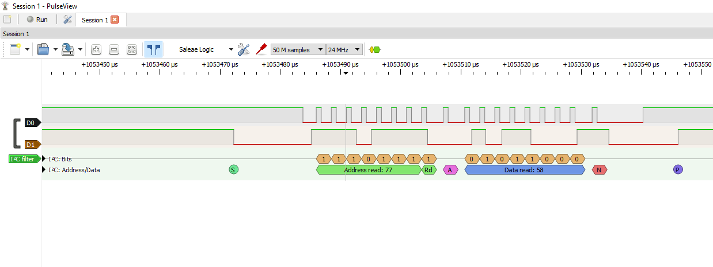
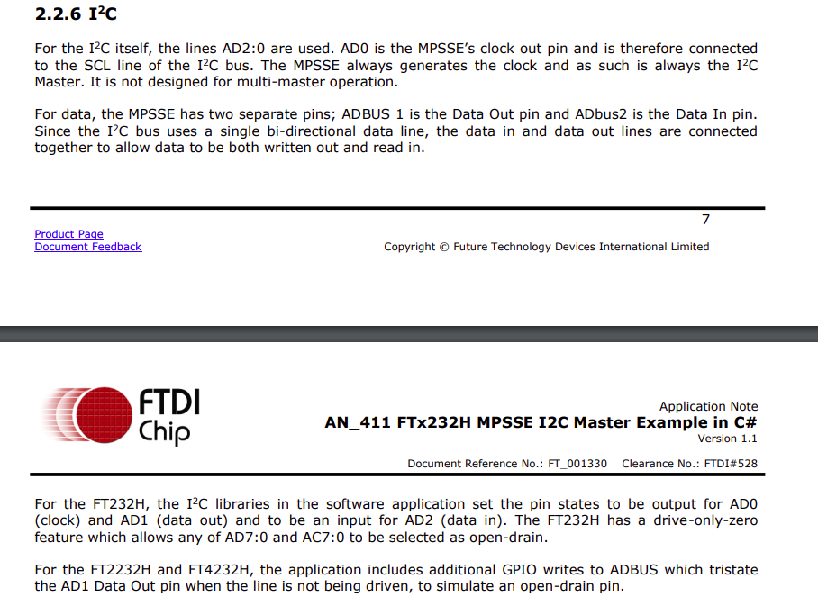

# FT2232H Windows 10 Code Examples



Windows 10 console applications using FT2232HL USB adapter to communicate with SPI and I2C slave devices.

Uses module interface A (AD bus) for SPI / I2C interface. Interface B is free to be used as a serial UART.

## Platform

* Windows 10 amdx64
* Install mingw from `http://www.mingw.org/wiki/Getting_Started`. You should have at least mingw-base-bin and the C/C++ compiler package installed.
* Install the latest Windows x64  FTDI USB D2XX drivers from `https://www.ftdichip.com/Drivers/D2XX.htm`. In my case, v2.12.28.

## FT2232H interface pinout



## SPI Master interface

Example code `spi_w25q16.c` reads the JEDEC ID `0xEF4015` from an W25Q16 SPI serial flash by sending the 
command 0x9F and then reading 3 consecutive bytes. SPI clock configured for 500kHz.

```
AD0 : CLK
AD1 : MOSI
AD2 : MISO
AD3 : CSn
```

Unfortunately, I was not able to reduce the CSn active time to below ~3mS.


## I2C Master interface


Example code `i2c_bmp280.c` reads the device ID data `0x58` at  register address 0xD0 from a BMP280 pressure sensor
configured in I2C mode with 7-bit slave address 0x77. I2C clock configured for 400kHz.





Ideally, the code should execute a repeated start after the write, followed by a read, all in one start-stop transaction. 
Instead it does a  write transaction with a stop.
Then a fresh transaction with a read, with a long delay between the two transactions. But the device responds with the data. Ah well.

Note : for I2C interface pins AD1 and AD2 need to be connected together for SDA bi-directional function.

```
AD0		: SCLK
AD1+AD2	: SDA
```

Reference : FTDI Application note AN_411





